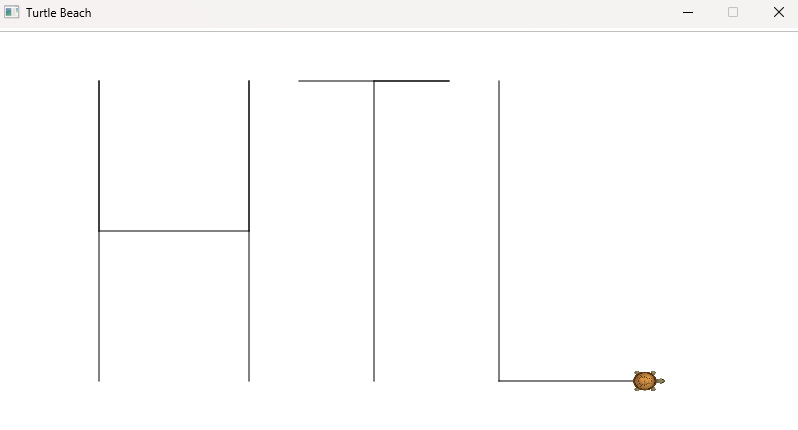

# LeoTurtle

Allows students to control a turtle, which can primarily only move forward and turn.
This turtle leaves track in the sand, and by looking at this track they can draw simple shapes.



## Turtle

The `Turtle` has the following capabilities:

- Can move forward a certain distance in meters
  - While moving forward, a line is drawn
- Can turn in degrees euler 
  - Positive values turn right
  - Negative values turn left
- Can teleport itself to a specific position
  - No line is drawn when teleporting
- Knows how many meters it has traveled
- Will stay within the boundaries of the 'beach'

### Smart Turtle

The `SmartTurtle` went to HTL Leonding and thus became the smarter cousin of `Turtle` with the following _additional_ capabilities:

- Knows where it is and can report its current position
- Can _look at_ a certain point on the beach
  - => turns to face that point automatically

## Sample Usage

```csharp
using LeoTurtle;

const int Length = 80;
const int Width = 40;
const string Basic = "1";
const string Smart = "2";

Console.Write($"Run Basic ({Basic}) or Smart ({Smart}) demo? ");
var choice = Console.ReadLine();
switch (choice)
{
    case Basic:
    {
        Beach.Prepare<Turtle>(WalkPath, 80, 40);
        break;
    }
    case Smart:
    {
        Beach.Prepare<SmartTurtle>(WalkSmartPath, 80, 40);
        break;
    }
    default:
    {
        Console.WriteLine("Unknown option");
        break;
    }
}

return;

static void WalkPath(Turtle turtle)
{
    turtle.Teleport(10, 5);
    turtle.MoveForward(30);
    turtle.Turn(180);
    turtle.MoveForward(15);
    turtle.Turn(-90);
    turtle.MoveForward(15);
    turtle.Turn(-90);
    turtle.MoveForward(15);
    turtle.Turn(180);
    turtle.MoveForward(30);
    
    turtle.Teleport(30, 35);
    turtle.Turn(90);
    turtle.MoveForward(15);
    turtle.Turn(180);
    turtle.MoveForward(15/2D);
    turtle.Turn(-90);
    turtle.MoveForward(30);
    
    turtle.Teleport(50, 35, false);
    turtle.MoveForward(30);
    turtle.Turn(-90);
    turtle.MoveForward(15);
}

static void WalkSmartPath(SmartTurtle turtle)
{
    turtle.Teleport(Length / 2D, Width / 2D);
    
    turtle.LookAt(50, 30);
    turtle.MoveForward(15);
    turtle.Turn(45);
    turtle.MoveForward(5);
    turtle.LookAt(0,0);
    turtle.MoveForward(30);
    
    Console.WriteLine($"Turtle has moved: {turtle.TravelDistanceMeters:F1} meters");
}
```

> I recommend providing the `Beach.Prepare<T>` call for the students and only letting them work within a method similar to `WalkPath` (from which they may call other methods, of course).

## License

- The source code is licensed under the MIT License.
- The turtle images are licensed under CC BY-SA 3.0 and CC BY-SA 4.0.

See [LICENSE](./LICENSE) for more information.